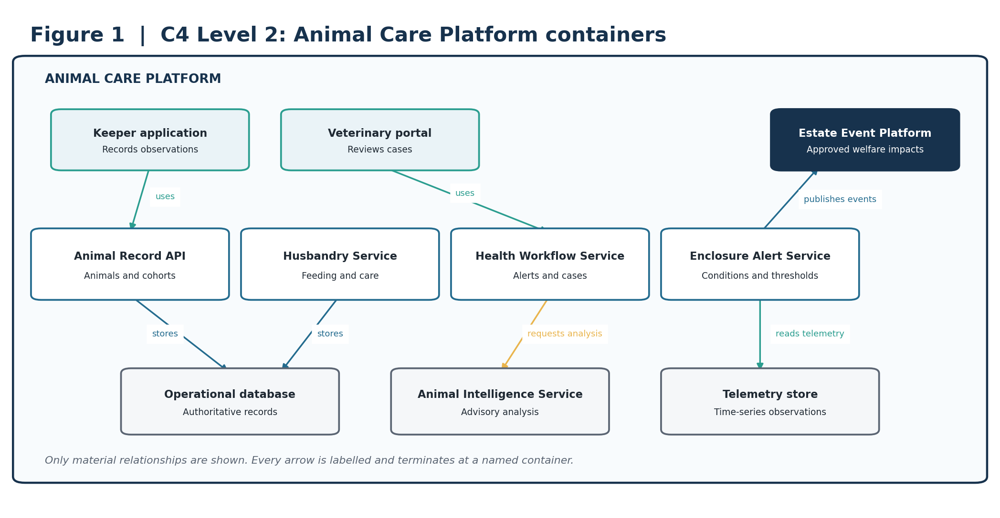
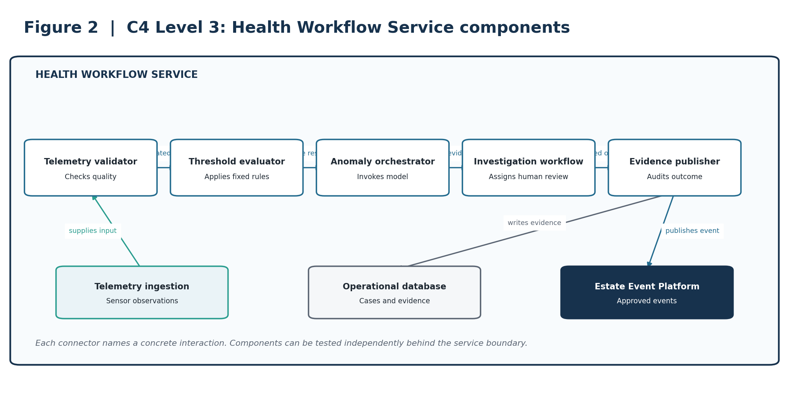
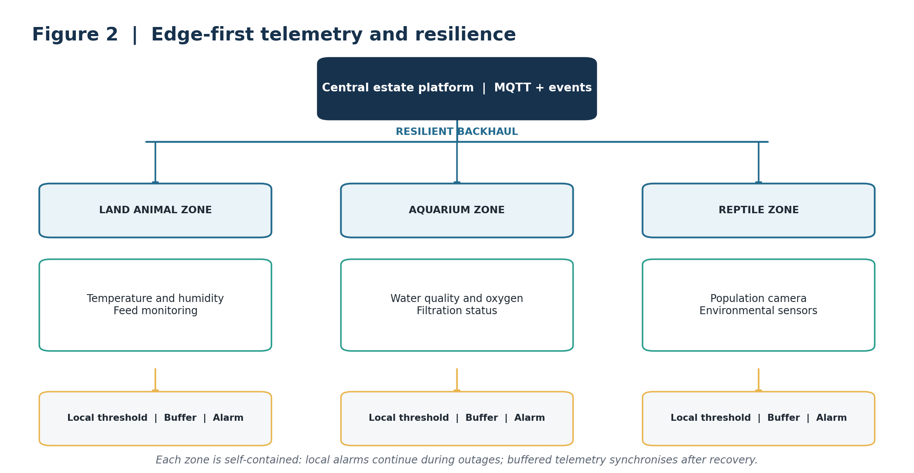
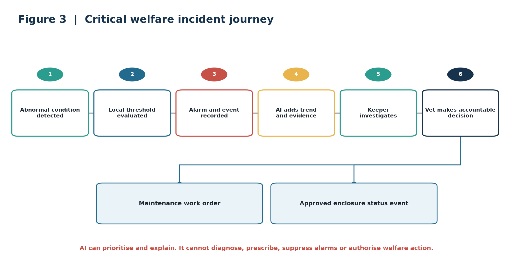
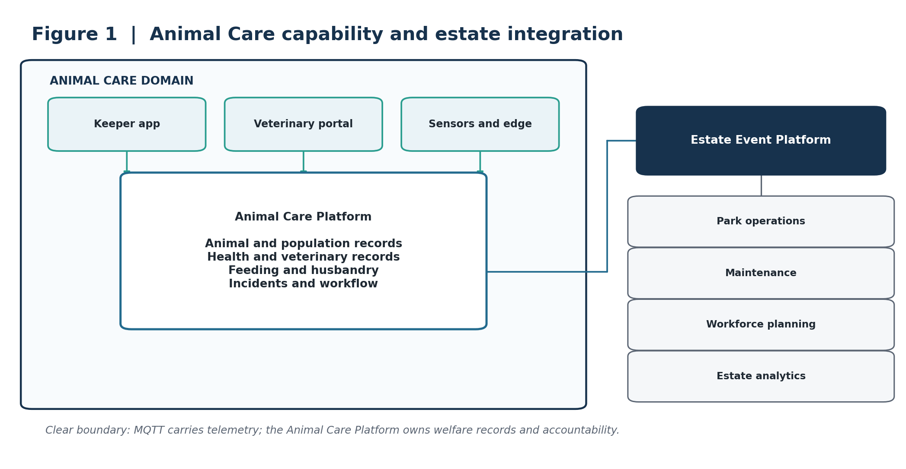
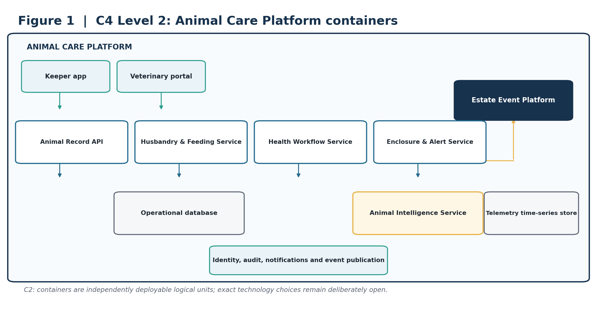
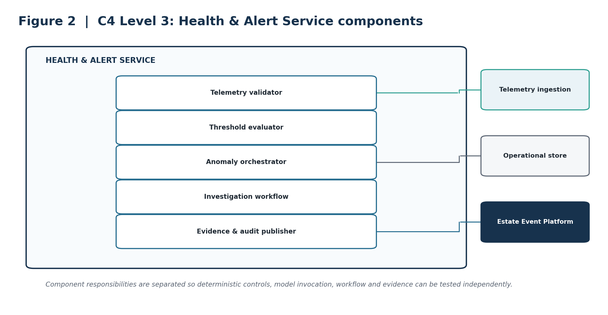

# Animal Care & Welfare Management

Architecture Kata Submission Section

> **ARCHITECTURE THESIS** — A resilient, event-driven Animal Care Platform combines keeper expertise, edge telemetry and governed AI to improve welfare and estate operations. AI augments decisions; qualified humans retain accountability.

## Submission focus

| **Outcome** | **Design response** |
| --- | --- |
| Protect animal welfare | Local deterministic alerting, accountable workflows and full audit history. |
| Operate through connectivity loss | Zoned gateways with local processing and durable store-and-forward. |
| Detect issues earlier | Explainable anomaly detection and forecasting, supported by human review. |
| Inform the wider estate | Curated domain events for operations, maintenance, workforce and analytics. |

### Scope note

The original brief specifies more than 200 animals across 55 displays and enclosures, including aquatic and land-based collections, and identifies patchy Wi-Fi as a technical constraint. Proposed numerical fitness targets in this section are initial architecture targets and require validation with animal-care specialists.

# 1. Business outcome and design principles

Animal illness, missed care activities and enclosure disruption increase cost and can damage visitor confidence. The proposed capability gives keepers and veterinary staff a reliable operational record of animal health, feeding, husbandry, population and enclosure conditions, while sharing only the minimum operational information needed by the wider park.

> **CORE BOUNDARY** — MQTT transports telemetry and events. The Animal Care Platform owns welfare records, workflows and accountability.

## Design principles

Welfare first: critical protection must not depend on cloud connectivity or AI availability.

Human accountability: keepers and veterinary professionals approve consequential actions.

Clear ownership: animal-care data remains authoritative within the Animal Care Platform.

Loose coupling: wider park systems consume governed domain events, not clinical records.

Evolvable AI: model interfaces, evaluation assets and audit history remain provider-neutral.

## Capability scope

| **Capability** | **Responsibilities** |
| --- | --- |
| Animal and population records | Animal identity, cohorts, enclosure assignment, movement and verified population counts. |
| Health and veterinary | Observations, examinations, treatment records, follow-up tasks and controlled access. |
| Feeding and husbandry | Care schedules, feed offered and consumed, cleaning, enrichment and exceptions. |
| Enclosure monitoring | Environmental telemetry, device condition, thresholds and enclosure operational state. |
| Incidents and workflow | Alert triage, ownership, escalation, evidence, resolution and audit history. |

# 2. C4 Level 2: container architecture

Figure 1. The Animal Care Platform is the welfare system of record; other estate capabilities integrate through curated events.

> **ARCHITECTURAL INTENT** — This boundary protects clinical and husbandry data while allowing operations, maintenance, workforce planning and analytics to respond to approved operational changes.

# 3. C4 Level 3: critical service components

Figure 2. Component view of the Health Workflow Service.

> **ARCHITECTURAL INTENT** — Separates deterministic threshold evaluation, AI orchestration, human investigation workflow and auditable evidence.

# 4. Deployment and resilience view

Figure 3. Zoned gateways provide local processing, alerting and store-and-forward across areas with unreliable connectivity.

> **ARCHITECTURAL INTENT** — Critical thresholds are evaluated locally. Routine telemetry is buffered and synchronised when connectivity returns. Cloud AI is never in the critical alarm path.

# 5. Dynamic view: critical welfare journey

Figure 4. A welfare event moves from deterministic local detection to evidence-backed AI analysis and accountable human action.

> **ARCHITECTURAL INTENT** — AI may identify trends and prioritise investigation. It cannot diagnose, prescribe, suppress an alarm, or authorise treatment or enclosure actions.

# 6. AI strategy and guardrails

AI is applied to bounded problems where its performance can be evaluated and where failure does not bypass deterministic controls or accountable staff.

| **Business need** | **AI capability** | **Required human control** |
| --- | --- | --- |
| Earlier indication of illness | Multivariate anomaly detection across feeding, activity, history and environment. | Keeper investigation and veterinary interpretation. |
| Aquatic population monitoring | Computer vision population estimate with confidence and evidence. | Manual verification before the authoritative count changes. |
| Environmental risk | Time-series forecasting of deteriorating enclosure conditions. | Keeper assesses conditions and selects action. |
| Faster access to guidance | Retrieval-based assistant using approved procedures and records. | Staff validate cited guidance before use. |

## Guardrails

| **AI may** | **AI may not** |
| --- | --- |
| Detect anomalies and forecast trends. | Diagnose an animal or prescribe treatment. |
| Summarise records and retrieve approved guidance. | Override or suppress deterministic alarms. |
| Create a reviewable investigation recommendation. | Modify welfare plans or operate life-support equipment. |
| Provide confidence, evidence and model version. | Publish welfare information or authorise closure without approval. |

## Validation and fallback

Evaluate models against labelled normal periods, known incidents, missing data and degraded sensor conditions.

Monitor input quality, drift, actionable-alert rate, overrides, dismissals and missed-event reviews.

If a model is unavailable or outside its approved conditions, continue local thresholds, scheduled inspections and telemetry capture.

Invoke models through versioned internal contracts so providers can be replaced without changing care workflows.

# 7. Architectural decision records

The following concise ADRs capture the decisions that most strongly shape the capability. Full ADRs can be maintained separately if the submission repository requires deeper alternatives and enforcement detail.

| **ID / decision** | **Context** | **Decision** | **Consequence** |
| --- | --- | --- | --- |
| ADR-AC-01 Animal Care Platform as system of record | Welfare data originates from devices and people. | Own health, husbandry, feeding, population and incident records in the Animal Care Platform. | Clear ownership and auditability; requires integration from telemetry and estate systems. |
| ADR-AC-02 Edge-first resilience | Connectivity is unreliable and welfare monitoring cannot depend on the cloud. | Use zoned gateways with local thresholds, alarms and encrypted store-and-forward. | Continues protection during outages; adds managed estate hardware. |
| ADR-AC-03 Event-driven estate integration | Operations, maintenance and workforce services need animal-care impacts. | Publish curated domain events through the Estate Event Platform. | Loose coupling and independent evolution; requires event-contract governance. |
| ADR-AC-04 AI is advisory only | Welfare decisions carry ethical, operational and reputational consequences. | AI can recommend investigation but cannot diagnose, prescribe or authorise action. | Preserves accountability; deliberately limits automation. |
| ADR-AC-05 Specialised AI by risk profile | Detection and generative assistance have different failure modes. | Use conventional ML or vision for bounded detection; use GenAI only for cited retrieval and summarisation. | Improves evaluability and reduces hallucination exposure; operates multiple model types. |
| ADR-AC-06 Provider-neutral inference boundary | AI models, providers and commercial terms will change. | Use versioned internal model contracts and retain evaluation assets independently. | Improves replaceability; introduces an abstraction and compatibility-testing burden. |

# 8. Architecture fitness functions

These are measurable, automatable where possible, and traceable to welfare, resilience, AI governance and integration outcomes. Targets are proposed starting points, not facts from the brief.

| **ID** | **Fitness function** | **Proposed success measure** | **Evidence** |
| --- | --- | --- | --- |
| FF-01 | Critical alert latency | At least 99.9% raised locally within 30 seconds of a confirmed threshold breach. | Gateway simulation and alert log. |
| FF-02 | Alert acknowledgement | At least 95% of critical alerts acknowledged within 5 minutes. | Workflow telemetry. |
| FF-03 | Telemetry durability | Less than 0.1% loss during a simulated 24-hour backhaul outage. | Quarterly resilience test. |
| FF-04 | Gateway fault isolation | Failure of one gateway does not stop monitoring in another zone. | Automated fail-isolation test. |
| FF-05 | Husbandry completion | At least 99% of mandatory daily tasks completed or formally excepted. | Daily workflow report. |
| FF-06 | Preventable closures | 30% reduction from an agreed baseline in closures attributed to preventable environmental causes. | Monthly outcome review. |
| FF-07 | AI usefulness | At least 70% of AI alerts are judged actionable after the evaluation period. | Keeper and vet disposition data. |
| FF-08 | AI evidence | 100% of AI alerts contain confidence, evidence reference and model version. | Schema validation in CI and runtime. |
| FF-09 | Model drift | All production models evaluated weekly; breaches create an owned review task. | MLOps control check. |
| FF-10 | Event delivery | At least 99.95% successful publication, with replay for recoverable failures. | Event-platform SLO dashboard. |

## Traceability summary

| **Outcome** | **Architecture response** | **ADRs** | **Fitness functions** |
| --- | --- | --- | --- |
| Protect welfare | Local alerts, accountable workflow, authoritative records | 01, 02, 04 | 01, 02, 05 |
| Resilient operation | Zoned edge gateways and store-and-forward | 02 | 03, 04 |
| Useful, safe AI | Bounded ML, human review and provider-neutral contracts | 04, 05, 06 | 07, 08, 09 |
| Wider park integration | Curated domain events and minimum-data projections | 03 | 10 |

# 9. Delivery sequence and conclusion

| **Phase** | **Scope** | **Value** |
| --- | --- | --- |
| 1. Digital care foundation | Animal, cohort and enclosure register; keeper tasks; feeding, health and audit workflows. | Creates accountable, authoritative operational records. |
| 2. Resilient telemetry | Priority sensors, zoned gateways, local alarms, central telemetry and maintenance integration. | Improves environmental visibility without cloud dependency. |
| 3. Governed intelligence | Anomaly detection, selected population counting, evaluation, drift monitoring and feedback. | Provides earlier warnings while retaining human control. |
| 4. Estate optimisation | Workforce and supply forecasts, approved enclosure status and cross-domain analytics. | Connects welfare outcomes with wider park planning and visitor operations. |

> **FINAL POSITION** — The architecture prioritises welfare, resilience and accountability. It uses AI where outputs can be evaluated and reviewed, while deterministic local controls and qualified staff remain responsible for consequential decisions.

## Source basis

Prepared from the supplied Architecture Kata 2026 brief and the accompanying submission-priorities, judging-rubric, prompt-output and submission-output documents. Numerical fitness targets are proposed by this submission and should be validated during discovery with animal-care specialists and estate operators.

