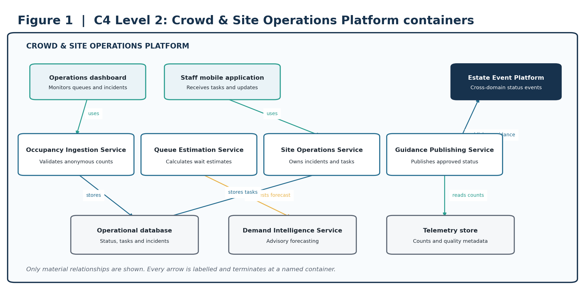
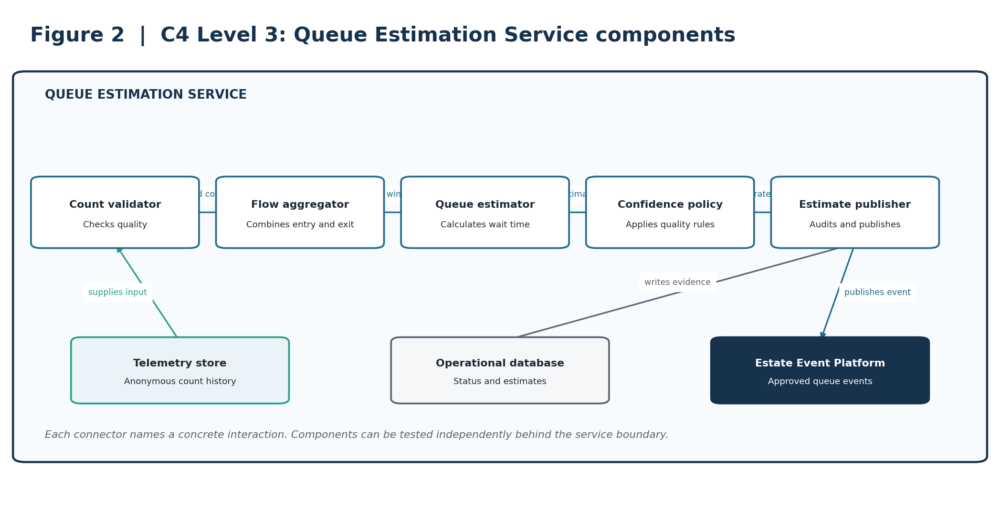
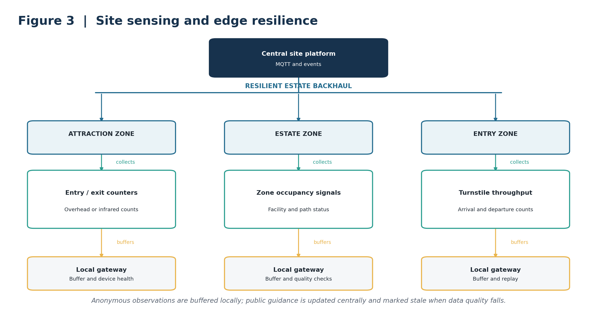
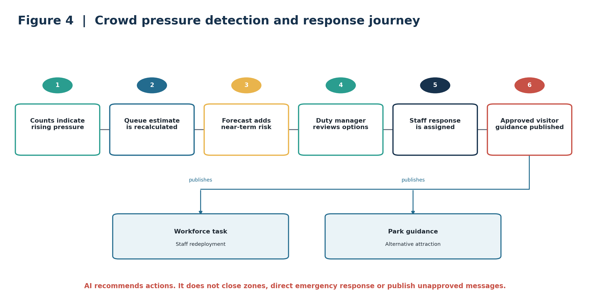

**VON DIGITALIS ESTATES**

Crowd & Site Operations

Architecture Kata Capability Submission

| **ARCHITECTURE THESIS  **A resilient event-driven platform turns distributed occupancy, throughput and operational signals into reliable queue estimates, staff tasks and park-wide awareness. AI forecasts demand and recommends responses; duty managers retain control. | | --- |

## Submission focus

| **Outcome** | **Design response** | | --- | --- |
| Improve visitor flow | Near-real-time occupancy, queue estimates and approved guidance. |
| Understand popularity | Comparable attraction and zone utilisation analytics. |
| Coordinate operations | Shared incidents, tasks and staffing signals. |
| Tolerate connectivity loss | Local collection, buffering and replay through zoned gateways. |

### Scope note

The brief asks the estate to understand how popular different parts of the park are and permits MQTT-capable devices despite patchy Wi-Fi. Queue sensing and operational targets below are proposed design choices.

# 1. Business outcome and design principles

Crowd pressure and poor visibility of site conditions reduce visitor satisfaction and complicate staffing. The capability provides a consistent view of occupancy, queues, attraction availability and operational incidents, while continuing to collect observations through connectivity disruption.

| **CORE BOUNDARY  **Edge devices observe occupancy and throughput. The Crowd & Site Operations Platform owns queue estimates, operational state, response workflows and published site guidance. | | --- |

## Design principles

Privacy by design: prefer anonymous counts over identity tracking.

Operational accountability: duty managers approve consequential responses.

Edge resilience: temporary network loss must not erase observations.

Event-driven integration: ride, animal and visitor capabilities exchange curated events.

AI remains advisory and falls back to deterministic rules and operator judgement.

## Capability scope

| **Capability** | **Responsibilities** | | --- | --- |
| Occupancy and queue estimation | Ingest counters and sensors; calculate quality-rated wait-time estimates. |
| Site status management | Track attraction, zone and facility availability and restrictions. |
| Operations workflow | Create, assign, escalate and close incidents and staff tasks. |
| Demand forecasting | Forecast zone pressure and resource needs with monitored models. |
| Public guidance | Publish approved queue, closure and alternative-attraction messages. |

# 2. C4 Level 2: container architecture

Figure 1. C2 containers for crowd sensing, queue estimation, operations workflow and approved guidance.

| **ARCHITECTURAL INTENT  **Separates raw observations, estimated queues, operational authority and public guidance. | | --- |

# 3. C4 Level 3: critical service components

Figure 2. C3 components within the Queue Estimation Service.

| **ARCHITECTURAL INTENT  **Makes count validation, estimation and confidence policy independently testable. | | --- |

# 4. Deployment and resilience view

Figure 3. Zoned collection and buffering for anonymous site observations.

| **ARCHITECTURAL INTENT  **Supports the brief’s patchy-connectivity constraint without presenting stale observations as current. | | --- |

# 5. Dynamic view: critical journey

Figure 4. Crowd pressure progresses from observation to approved operational response.

| **ARCHITECTURAL INTENT  **Combines deterministic estimates and advisory forecasting with accountable duty-manager decisions. | | --- |

# 6. AI strategy and guardrails

AI is used for bounded demand forecasting and recommendation ranking, not for emergency command or autonomous crowd control.

| **Business need** | **AI capability** | **Required human control** | | --- | --- | --- |
| Anticipate pressure | Short-horizon demand forecast by zone and attraction. | Duty manager approves response. |
| Improve alternatives | Rank suitable attractions using status, capacity and predicted demand. | Operations approves published guidance. |
| Find emerging patterns | Anomaly detection across occupancy and throughput. | Operator investigates data and conditions. |
| Support handover | Cited summary of incidents and actions. | Staff verify the operational record. |

## Guardrails

| **AI may** | **AI may not** | | --- | --- |
| Forecast demand and rank options. | Issue emergency instructions autonomously. |
| Flag sensor anomalies and stale estimates. | Identify or track individuals. |
| Recommend staffing or message changes. | Close zones or publish unapproved guidance. |
| Summarise approved operational records. | Override safety or security procedures. |

## Validation and fallback

Validate queue estimates against periodic manual observations across operating conditions.

Monitor sensor completeness, estimate error, stale-data duration, drift and overridden recommendations.

When AI is unavailable, continue deterministic estimates, operator workflows and stale-data labelling.

Retain versioned model contracts, evidence and outcome feedback independently of the provider.

# 7. Architectural decision records

These concise ADRs capture the decisions that most strongly shape the capability.

| **ID / decision** | **Context** | **Decision** | **Consequence** | | --- | --- | --- | --- |
| ADR-CS-01  
Anonymous counting by default | Popularity insight does not require personal identity. | Use counts and throughput; prohibit biometric identity processing. | Reduces privacy risk; limits individual-level analysis. |
| ADR-CS-02  
Queue estimates are derived state | Sensors provide observations, not authoritative waiting time. | Calculate estimates with confidence and freshness metadata. | Supports quality-aware guidance; requires calibration. |
| ADR-CS-03  
Edge-first ingestion | Connectivity is patchy. | Use zoned gateways with buffer, replay and device health. | Preserves observations; adds managed hardware. |
| ADR-CS-04  
Event-driven integration | Ride and site status change independently. | Exchange curated events through the estate backbone. | Loose coupling; requires contract governance. |
| ADR-CS-05  
AI is advisory | Forecasts can be wrong during unusual conditions. | Require duty-manager approval for consequential actions. | Maintains accountability; limits automation. |
| ADR-CS-06  
Separate operational and public views | Internal incidents may contain sensitive detail. | Publish sanitised status and guidance projections. | Protects data; requires projection logic. |

# 8. Architecture fitness functions

Targets are proposed starting points and require validation against operational baselines.

| **ID** | **Fitness function** | **Proposed success measure** | **Evidence** | | --- | --- | --- | --- |
| FF-CS-01 | Queue estimate accuracy | Median absolute error within an agreed threshold after calibration. | Manual sample comparison. |
| FF-CS-02 | Estimate freshness | At least 99% of published estimates carry current freshness and confidence metadata. | Schema and dashboard check. |
| FF-CS-03 | Telemetry durability | Less than 0.1% loss in a simulated 24-hour backhaul outage. | Quarterly resilience test. |
| FF-CS-04 | Stale-data safety | 100% of stale estimates withdrawn or visibly labelled within the agreed threshold. | Automated policy test. |
| FF-CS-05 | Incident acknowledgement | At least 95% of priority tasks acknowledged within target. | Workflow telemetry. |
| FF-CS-06 | Event delivery | At least 99.95% successful publication with replay. | Event-platform SLO. |
| FF-CS-07 | Forecast usefulness | At least 70% of recommendations judged actionable after evaluation. | Duty-manager disposition. |
| FF-CS-08 | AI evidence | 100% of recommendations include evidence, confidence and model version. | Schema validation. |
| FF-CS-09 | Privacy control | No prohibited identifiers in occupancy event contracts. | Contract and privacy tests. |
| FF-CS-10 | Device health | 100% of expected devices report health or create an owned incident. | Device operations dashboard. |

## Traceability summary

| **Outcome** | **Architecture response** | **ADRs** | **Fitness functions** | | --- | --- | --- | --- |
| Visitor flow | Queue estimates and approved guidance | 01, 02, 06 | 01, 02, 04 |
| Resilient operation | Zoned gateways and replay | 03 | 03, 10 |
| Safe AI | Advisory forecasts and approval | 05 | 07, 08 |
| Cross-estate coordination | Curated status events | 04, 06 | 05, 06 |
| Privacy | Anonymous counts and contract tests | 01 | 09 |

# 9. Delivery sequence and conclusion

| **Phase** | **Scope** | **Value** | | --- | --- | --- |
| 1. Operations foundation | Site status, incidents, staff tasks and basic counters. | Creates accountable operating data. |
| 2. Queue visibility | Calibrated estimates, freshness and public guidance. | Improves visitor flow decisions. |
| 3. Governed forecasting | Demand models, evaluation and recommendation feedback. | Supports earlier intervention. |
| 4. Estate optimisation | Cross-domain staffing, ride and visitor analytics. | Improves estate-wide coordination. |

| **FINAL POSITION  **The design makes queue information useful without confusing raw sensor readings with truth. Privacy-preserving observations, resilient ingestion and human-approved guidance connect site conditions to park operations. | | --- |

## Source basis

Prepared from the supplied Architecture Kata 2026 brief and accompanying working documents. The brief explicitly requires ticketing, insight into park popularity, visitor growth and profitability, and notes patchy Wi-Fi with budget for MQTT-capable devices. Detailed architecture and numerical targets are proposed by this submission and require stakeholder validation.

