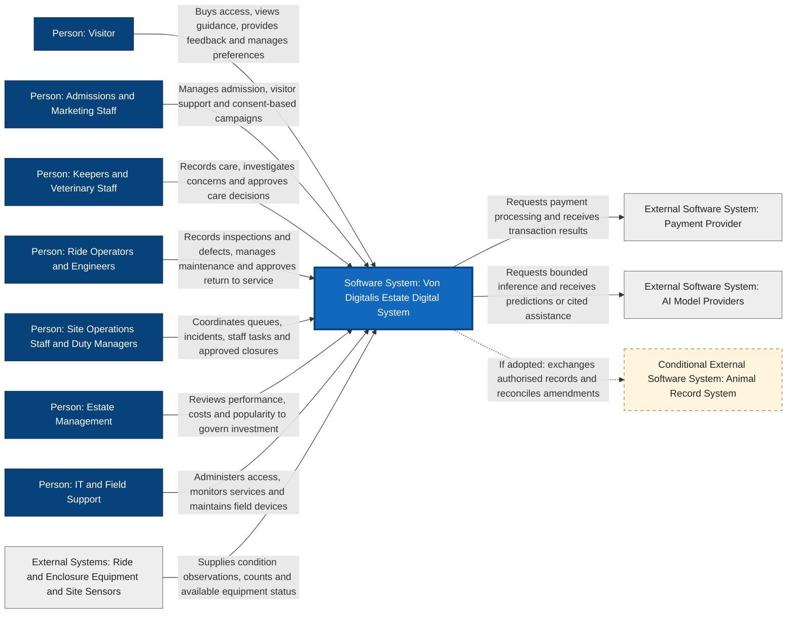

# Estate C4 System Context

The Von Digitalis Estate Digital System enables visitors to buy access and enjoy the estate, staff to manage rides, animal care and daily site operations, and management to measure performance and plan investment.

## Context Diagram

Blue nodes represent people and the system of interest. Grey nodes represent external dependencies. The dashed relationship and amber node identify an integration whose adoption remains unconfirmed. People-to-system arrows describe use; they do not imply that information only travels in one direction.

## System Boundary

This is a C4 Level 1 view of the integrated estate digital system. Its logical scope includes visitor services, animal care, ride operations, Site Operations and Estate Management reporting. It also includes the purchased CRM and ticketing capabilities, estate applications, shared integration services and managed edge gateways. Internal services, databases and interactions belong in the capability and container views.

Purchased software can be inside this logical scope even when vendor-hosted. This boundary describes the estate solution, not its hosting or procurement boundary. The CRM buy decision is confirmed; the product remains unselected and must support suitable integration through an API or another mechanism such as MCP or CLI. This view does not assign conflicting ownership of customer or consent records across products.

Site Operations coordinates daily workflows and responses. Estate Management uses evidence for strategic planning, investment, budgets and performance accountability; it does not own day-to-day staff dispatch.

## External Dependencies and Authority

| Dependency | Relationship and Boundary |
|---|---|
| Payment Provider | Processes payment requests and returns transaction outcomes. Commerce and entitlement decisions remain deterministic. No provider is selected in this view. |
| AI Model Providers | Supply externally hosted inference where selected. Local models remain internal implementation details. Essential workflows retain non-AI fallbacks, and qualified people retain consequential decision authority. |
| Ride and Enclosure Equipment and Site Sensors | Supply observations from the physical estate. Independent ride protection and essential local welfare protection remain outside the digital system's control authority; the observation relationship does not authorise commands to safety interlocks or life-support equipment. Actual instrumentation and interfaces require site validation. |
| Animal Record System | Conditional integration with an external authoritative animal record, such as ZIMS. Existing use, access and record ownership must be confirmed before adopting this relationship. Its inclusion is not a product decision. |

Visitors can interact through digital channels or staff assistance. No smartphone requirement is implied. Keepers, veterinary staff, engineers and duty managers retain their respective approval responsibilities. The separate ride-release and operational-closure authority rules still require the clarification identified in the capability review.

