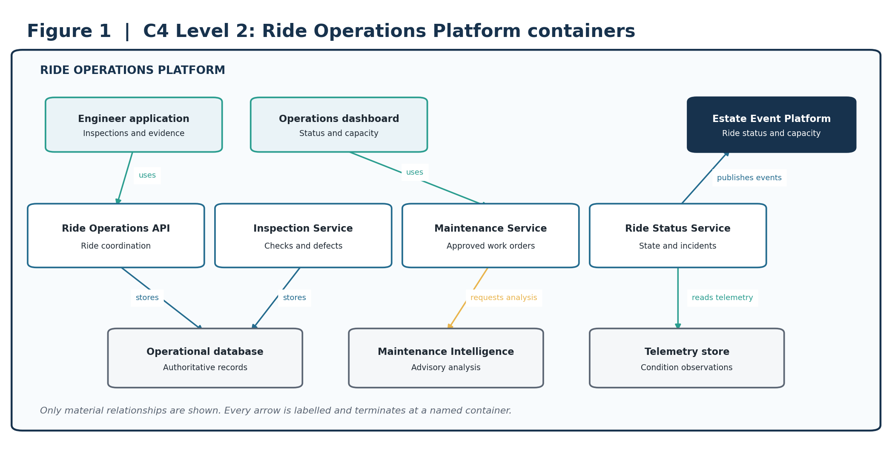
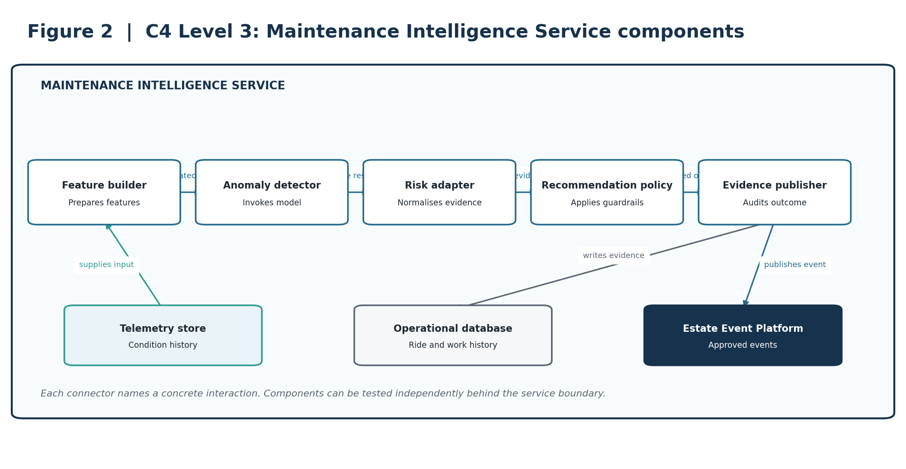
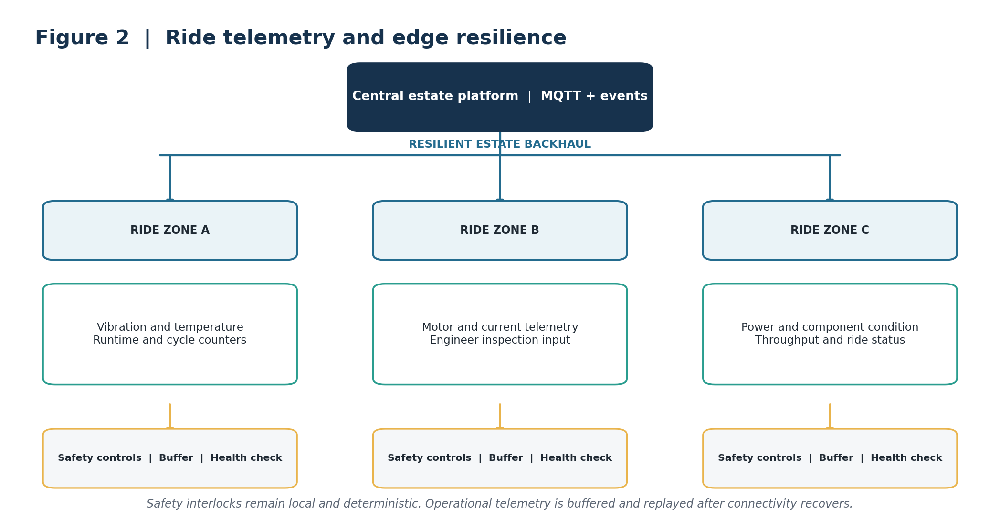
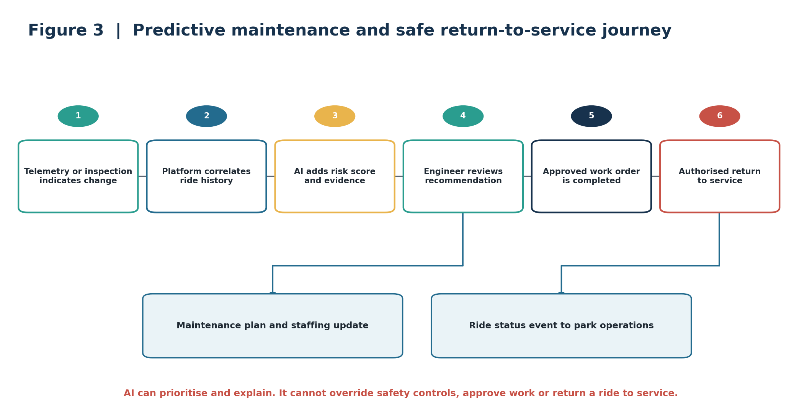
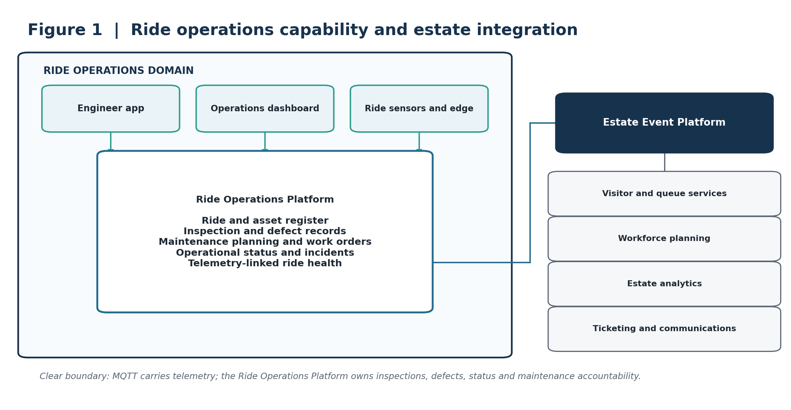
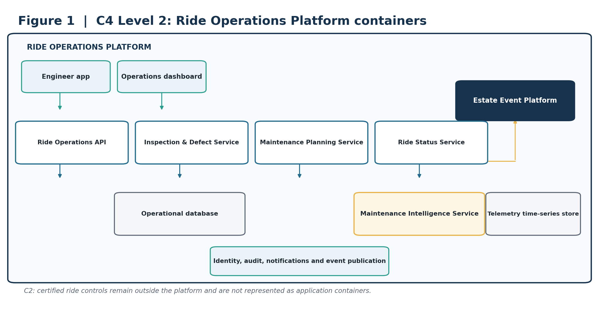
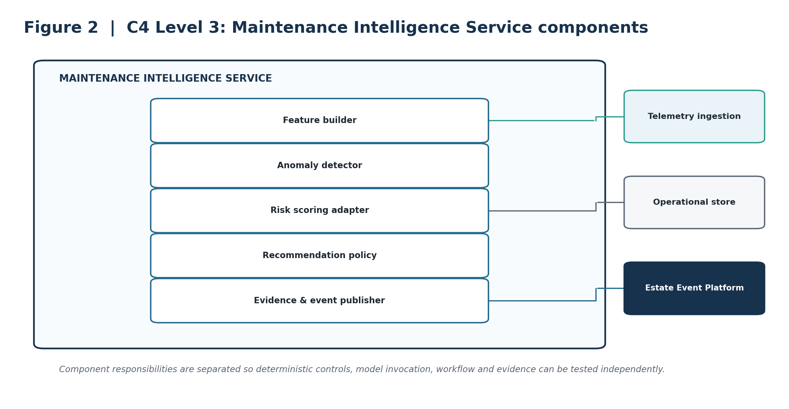

# Ride Operations & Asset Reliability

Architecture Kata Submission Section

> **ARCHITECTURE THESIS** — A resilient Ride Operations Platform combines inspections, operational telemetry, maintenance workflows and governed AI to improve availability and reduce unplanned downtime. AI supports engineers; deterministic safety controls and authorised people retain accountability.

## Submission focus

| **Outcome** | **Design response** |
| --- | --- |
| Improve ride reliability | Unified ride health, inspection and maintenance history. |
| Reduce unplanned downtime | Telemetry-based anomaly detection and planned intervention. |
| Operate through connectivity loss | Zoned gateways with durable buffering and replay. |
| Inform the wider estate | Ride status, capacity and maintenance events for operations, queues, staffing and analytics. |

### Scope note

The brief states that the estate contains 40 historically important rides and identifies patchy Wi-Fi as a constraint. Proposed numerical fitness targets are initial architecture targets and require validation with ride engineers, operations leaders and safety specialists.

# 1. Business outcome and design principles

Ride failures reduce capacity, disrupt the visitor experience and create reactive engineering work. The proposed capability establishes a reliable operational record of each ride, correlating inspections, defects, work orders, runtime and condition telemetry. It also shares approved ride-status and demand events with wider park systems.

> **CORE BOUNDARY** — MQTT transports operational telemetry and events. The Ride Operations Platform owns ride status, inspections, defects, maintenance records and accountability.

## Design principles

Safety first: existing ride safety systems and interlocks remain deterministic, local and independent.

Human authorisation: qualified engineers approve maintenance, closure and return-to-service decisions.

Clear ownership: the Ride Operations Platform is authoritative for operational and maintenance records.

Loose coupling: park capabilities consume governed events rather than direct database integrations.

Evolvable AI: maintenance models are explainable, monitored and replaceable.

## Capability scope

| **Capability** | **Responsibilities** |
| --- | --- |
| Ride and asset register | Ride identity, components, location, criticality and service history. |
| Inspection and defect management | Checks, findings, evidence, severity, ownership and closure. |
| Maintenance planning | Preventive work, approved work orders, parts, resources and completion evidence. |
| Ride operations | Opening status, runtime, cycles, capacity, interruptions and incident workflow. |
| Telemetry-linked health | Condition data, data-quality status, trends and anomaly evidence. |

# 2. C4 Level 2: container architecture

Figure 1. The Ride Operations Platform owns ride health and maintenance accountability; wider estate services consume curated events.

> **ARCHITECTURAL INTENT** — This boundary lets ride operations evolve independently while providing park operations, workforce planning, visitor services and analytics with approved operational signals.

# 3. C4 Level 3: critical service components

Figure 2. Component view of the Maintenance Intelligence Service.

> **ARCHITECTURAL INTENT** — Separates feature preparation, model invocation, recommendation policy and evidence publication so each can be validated independently.

# 4. Deployment and resilience view

Figure 3. Zoned gateways collect and buffer ride telemetry without replacing local safety controls.

> **ARCHITECTURAL INTENT** — Telemetry supports analysis and planning. It does not become the safety-control path, and temporary network loss does not erase operational observations.

# 5. Dynamic view: predictive maintenance journey

Figure 4. Telemetry and inspections lead to evidence-backed recommendations, engineer review, approved maintenance and authorised return to service.

> **ARCHITECTURAL INTENT** — AI recommends and prioritises. Engineers remain accountable for investigation, work approval and return-to-service decisions.

# 6. AI strategy and guardrails

AI is applied to bounded operational questions where recommendations can be tested against engineering outcomes and where failure cannot bypass safety controls.

| **Business need** | **AI capability** | **Required human control** |
| --- | --- | --- |
| Earlier fault indication | Condition and anomaly detection across runtime, vibration, temperature, current and maintenance history. | Engineer investigates and determines significance. |
| Better maintenance timing | Failure-risk and remaining-useful-life estimates where sufficient evidence exists. | Engineer approves work and timing. |
| Anticipate ride demand | Demand forecasting using historical throughput and park conditions. | Duty manager approves staffing and visitor-flow response. |
| Faster troubleshooting | Retrieval-based assistant over approved manuals, inspections and service history. | Engineer validates cited guidance before use. |

## Guardrails

| **AI may** | **AI may not** |
| --- | --- |
| Identify anomalies and maintenance risk. | Override ride controls or safety interlocks. |
| Recommend investigation and maintenance windows. | Shut down, open or return a ride to service autonomously. |
| Forecast demand and capacity pressure. | Approve maintenance work or certify safety. |
| Summarise and cite approved engineering information. | Conceal deterministic alarms or present unsupported conclusions. |

## Validation and fallback

Validate against known defects, normal operation, seasonal variation and simulated missing or faulty telemetry.

Monitor data quality, drift, recommendation acceptance, false alerts and missed-failure reviews.

When a model is unavailable or outside its approved conditions, continue inspections, preventive schedules and deterministic alarms.

Use versioned internal inference contracts so models and providers can be replaced without changing operational workflows.

# 7. Architectural decision records

These concise ADRs capture the decisions that most strongly shape the capability.

| **ID / decision** | **Context** | **Decision** | **Consequence** |
| --- | --- | --- | --- |
| ADR-RO-01 — Ride Operations Platform as system of record | Data arrives from engineers, operations and devices. | Own status, inspections, defects and maintenance history in the Ride Operations Platform. | Clear accountability and auditability; requires integration from telemetry and estate systems. |
| ADR-RO-02 — Safety controls remain local and deterministic | Connectivity and AI cannot be trusted for immediate safety action. | Keep certified ride controls and interlocks outside the cloud and AI path. | Preserves safety independence; limits remote automation. |
| ADR-RO-03 — Edge-first telemetry resilience | Estate connectivity is patchy. | Use zoned gateways with buffering, health checks and replay. | Retains operational data through outages; adds managed estate hardware. |
| ADR-RO-04 — Event-driven estate integration | Queue, visitor, workforce and analytics services need ride status. | Publish curated ride domain events through the Estate Event Platform. | Loose coupling; requires versioned event contracts and replay governance. |
| ADR-RO-05 — AI is advisory for maintenance | Predictions are non-deterministic and safety consequences are material. | AI creates evidence-backed recommendations; engineers authorise action. | Predictive value without delegating accountability; lower automation. |
| ADR-RO-06 — Provider-neutral model boundary | Models, providers and economics will change. | Use internal versioned inference contracts and retain evaluation assets independently. | Improves replaceability; adds abstraction and compatibility testing. |

# 8. Architecture fitness functions

Targets below are proposed starting points. Baselines and final thresholds should be agreed with ride engineering and operations teams.

Physical ride availability (FF-RO-01) and software-service availability ([NFR-03](../requirements/04_Non_Functional_Requirements.md)) are separate measures. A ride may be closed for a defect while its software service remains available; conversely, a ride may continue operating under authorised local procedures during a software outage. Measure and report each independently.

| **ID** | **Fitness function** | **Proposed success measure** | **Evidence** |
| --- | --- | --- | --- |
| FF-RO-01 | Physical ride availability | At least 99% during scheduled ride operating hours, excluding approved planned maintenance. Measures whether the ride is available for visitor use, not whether the supporting software service is available. | Ride operating-status and downtime records. |
| FF-RO-02 | Unplanned downtime | 30% reduction from an agreed baseline. | Monthly reliability review. |
| FF-RO-03 | Maintenance warning lead time | For validated model classes, at least 80% of detectable faults warned 24 hours before failure. | Model outcome review. |
| FF-RO-04 | Telemetry durability | Less than 0.1% loss during a simulated 24-hour backhaul outage. | Quarterly resilience test. |
| FF-RO-05 | Inspection compliance | 100% of mandatory pre-opening checks completed or ride remains unavailable. | Workflow control. |
| FF-RO-06 | Work-order timeliness | At least 95% completed within agreed priority targets. | Maintenance report. |
| FF-RO-07 | AI usefulness | At least 70% of AI recommendations judged actionable after evaluation. | Engineer disposition data. |
| FF-RO-08 | AI evidence | 100% include confidence, evidence reference, model version and supported operating conditions. | Schema validation. |
| FF-RO-09 | Model drift | All production models evaluated weekly; detected breaches routed within five minutes and unsafe models disabled within ten minutes of confirmed breach; safety-critical actions remain independently gated. | MLOps control. |
| FF-RO-10 | Ride event delivery | At least 99.95% published successfully, with replay for recoverable failures. | Event-platform SLO. |

## Traceability summary

| **Outcome** | **Architecture response** | **ADRs** | **Fitness functions** |
| --- | --- | --- | --- |
| Safe, reliable operation | Local controls, inspections and authoritative ride records | 01, 02 | 01, 05 |
| Resilient telemetry | Zoned gateways, buffering and replay | 03 | 04 |
| Reduced downtime | Condition analysis and integrated maintenance workflow | 01, 05 | 02, 03, 06 |
| Useful, safe AI | Advisory models, evidence and provider-neutral contracts | 05, 06 | 07, 08, 09 |
| Wider park coordination | Curated ride-status and capacity events | 04 | 10 |

# 9. Delivery sequence and conclusion

| **Phase** | **Scope** | **Value** |
| --- | --- | --- |
| 1. Operational foundation | Ride register, inspections, defects, status and maintenance workflows. | Creates authoritative and accountable operating records. |
| 2. Resilient telemetry | Priority sensors, zoned gateways, device health and replay. | Adds condition visibility without safety-control dependency. |
| 3. Governed intelligence | Anomaly detection, maintenance risk, evaluation, feedback and drift monitoring. | Enables earlier intervention with engineer oversight. |
| 4. Estate optimisation | Ride status, demand, queue, staffing and visitor-communication integration. | Connects reliability decisions to capacity and visitor experience. |

> **FINAL POSITION** — The architecture improves availability and maintenance planning without placing AI or cloud connectivity in the safety path. Certified controls remain local, engineers retain authority, and curated events connect ride health to the wider estate.

## Source basis

Prepared from the supplied Architecture Kata 2026 brief and accompanying submission-priorities and working documents. The brief provides the estate context, ride count and connectivity constraint. The detailed architecture, ADRs and numerical fitness targets are proposed by this submission and require validation with ride engineering, operations and safety specialists.

