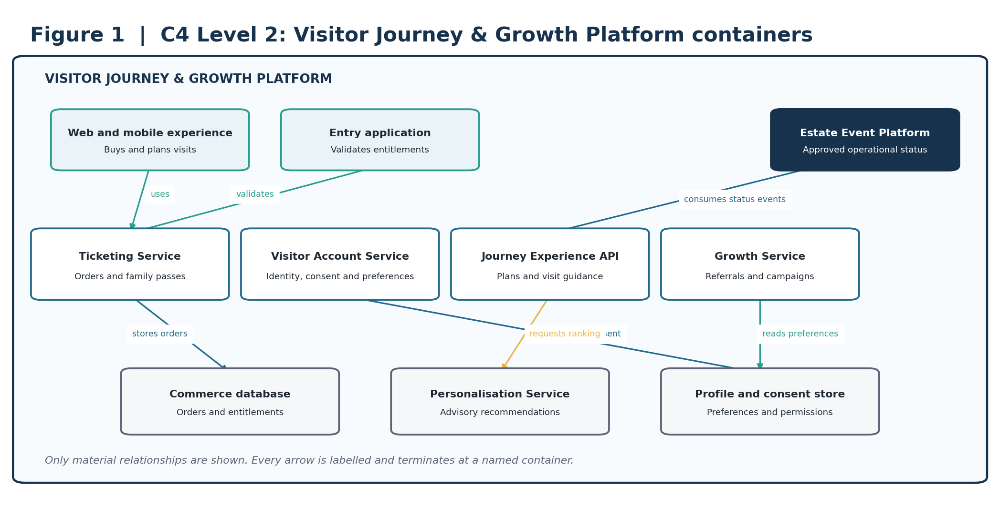
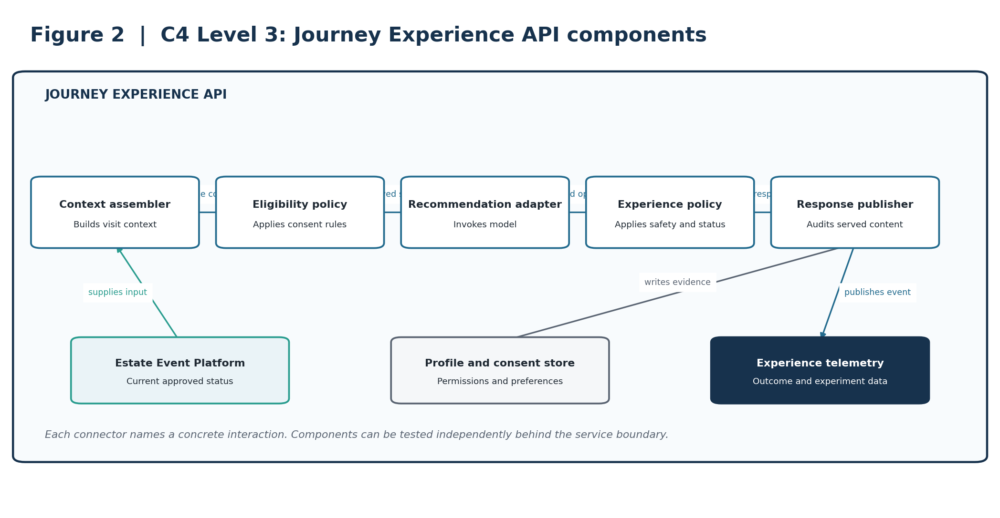
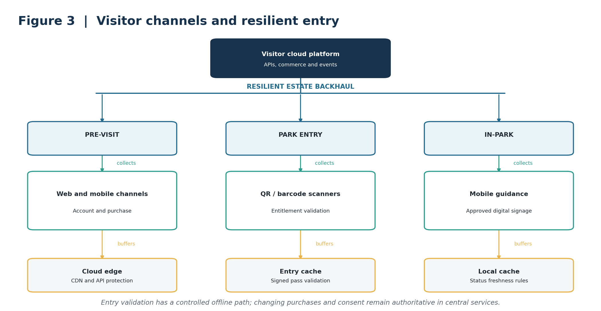
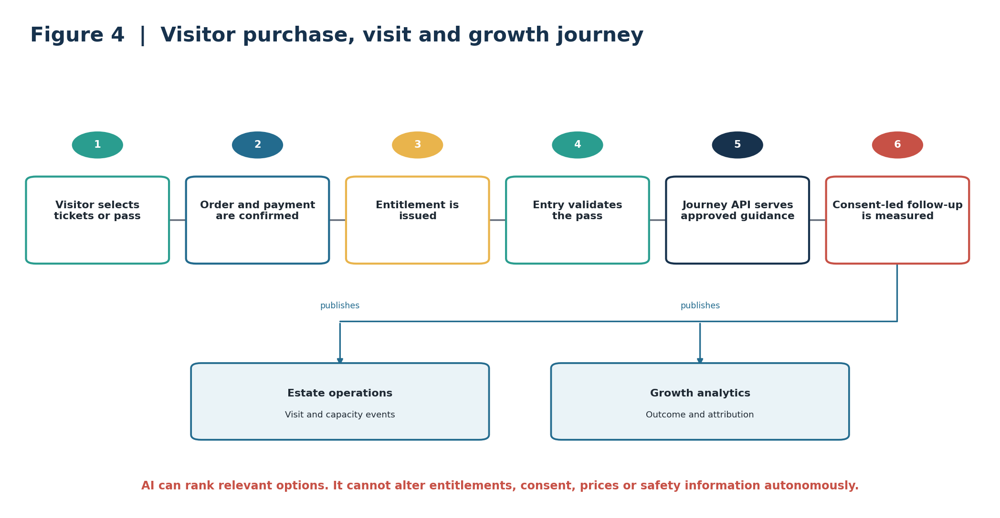

**VON DIGITALIS ESTATES**

Visitor Journey & Growth

Architecture Kata Capability Submission

| **ARCHITECTURE THESIS** | A consent-led visitor platform unifies ticketing, family passes, visit planning and measured engagement to make visits easier and support sustainable growth. AI personalises recommendations within explicit privacy, safety and commercial guardrails. |
| --- | --- |

## Submission focus

| **Outcome** | **Design response** |
| --- | --- |
| Simple purchase and entry | Digital ticketing, family passes and reliable entitlement validation. |
| Better visit planning | Current status, queue and approved attraction information. |
| Sustainable growth | Consent-led referrals, repeat-visit and campaign measurement. |
| Protect trust | Data minimisation, explicit consent and bounded personalisation. |

### Scope note

The brief explicitly asks for ticket sales including family passes, visitor growth, profitability and insight into park popularity. Identity, consent and growth targets below are proposed architecture choices.

# 1. Business outcome and design principles

The visitor journey must support purchase, entry, in-visit planning and post-visit engagement without forcing operational systems into a single monolith. The platform creates a reliable commercial and consent record, consumes live estate status and measures whether recommendations improve visits and repeat engagement.

| **CORE BOUNDARY** | The Visitor Platform owns accounts, consent, orders, passes and engagement preferences. Operational capabilities own live ride, queue, animal and site status and share only curated events. |
| --- | --- |

## Design principles

Commercial transactions remain deterministic and auditable.

Consent and communication preferences are first-class records.

Live operational truth remains owned by operational domains.

Recommendations are explainable, suppressible and never safety-critical.

Growth experiments use measurable outcomes and controlled exposure.

## Capability scope

| **Capability** | **Responsibilities** |
| --- | --- |
| Ticketing and passes | Products, orders, payments, family entitlements and entry validation. |
| Visitor account and consent | Profiles, household links, preferences and communication permissions. |
| Journey orchestration | Pre-visit planning, in-visit guidance and post-visit follow-up. |
| Growth and engagement | Referrals, campaigns, offers, experiments and attribution. |
| Personalisation | Rank relevant content using approved signals and monitored models. |

# 2. C4 Level 2: container architecture

Figure 1. C2 containers for commerce, consent, journey experience and growth.

| **ARCHITECTURAL INTENT** | Keeps commercial and consent records authoritative while consuming operational truth through events. |
| --- | --- |

# 3. C4 Level 3: critical service components

Figure 2. C3 components within the Journey Experience API.

| **ARCHITECTURAL INTENT** | Makes consent eligibility, recommendation invocation and safety filtering independently testable. |
| --- | --- |

# 4. Deployment and resilience view

Figure 3. Visitor channels with a controlled resilient entry path.

| **ARCHITECTURAL INTENT** | Preserves entry during a bounded connectivity interruption without creating a second source of truth. |
| --- | --- |

# 5. Dynamic view: critical journey

Figure 4. The visitor journey connects purchase, entry, guided experience and consent-led growth.

| **ARCHITECTURAL INTENT** | Shows measurable growth as an outcome of a trusted visit rather than an uncontrolled messaging pipeline. |
| --- | --- |

# 6. AI strategy and guardrails

AI is used to rank relevant content and support journey planning. It does not change commercial entitlements, consent or safety-critical information.

| **Business need** | **AI capability** | **Required human control** |
| --- | --- | --- |
| Relevant planning | Rank attractions using preferences and approved live status. | Visitor chooses; policy filters output. |
| Improve repeat visits | Identify audience segments and likely interests. | Marketing approves campaign and consent scope. |
| Support questions | Retrieval-based assistant over approved park information. | Citations and escalation are required. |
| Measure growth | Experiment analysis and outcome attribution. | Product owner approves interpretation and rollout. |

## Guardrails

| **AI may** | **AI may not** |
| --- | --- |
| Rank approved attractions and content. | Alter ticket, pass, price or refund records. |
| Use consented preferences and visit context. | Infer or use prohibited sensitive traits. |
| Summarise cited park information. | Override closure, accessibility or safety information. |
| Recommend campaign audiences. | Contact visitors without valid consent. |

## Validation and fallback

Evaluate recommendations for relevance, diversity, status correctness and business outcome.

Monitor consent-filter violations, stale operational content, drift and experiment guardrail metrics.

When AI is unavailable, serve deterministic popular, available and editorially approved content.

Version model contracts, prompts, evaluation sets and served-response evidence independently of providers.

# 7. Architectural decision records

These concise ADRs capture the decisions that most strongly shape the capability.

| **ID / decision** | **Context** | **Decision** | **Consequence** |
| --- | --- | --- | --- |
| ADR-VG-01 Commerce is deterministic | Tickets and passes are contractual entitlements. | Keep order, payment and entitlement decisions outside generative AI. | Strong auditability; less conversational automation. |
| ADR-VG-02 Consent is first-class | Growth activity depends on valid permission. | Centralise consent and enforce it at every outbound decision. | Improves trust; adds policy integration. |
| ADR-VG-03 Operational truth stays in domains | Ride and site status changes independently. | Consume curated status events rather than copy operational ownership. | Reduces inconsistency; requires freshness handling. |
| ADR-VG-04 Controlled offline entry | Entry cannot rely solely on live cloud access. | Validate signed, time-bounded entitlements from a local cache. | Maintains entry; requires revocation and reconciliation design. |
| ADR-VG-05 AI recommendations are advisory | Ranking can be wrong or stale. | Apply consent, availability and safety policies after model output. | Bounds risk; may reduce recommendation yield. |
| ADR-VG-06 Growth uses experimentation | Correlation alone cannot prove value. | Use controlled experiments with guardrail metrics and attribution. | Improves evidence; adds analytical discipline. |

# 8. Architecture fitness functions

Targets are proposed starting points and require validation against operational baselines.

| **ID** | **Fitness function** | **Proposed success measure** | **Evidence** |
| --- | --- | --- | --- |
| FF-VG-01 | Purchase availability | Meet an agreed availability SLO for browse, checkout and entitlement issuance. | Commerce SLO dashboard. |
| FF-VG-02 | Entitlement integrity | 100% of admitted entries map to a valid entitlement or approved exception. | Entry reconciliation. |
| FF-VG-03 | Offline entry | Signed-pass validation continues for the agreed outage window. | Resilience exercise. |
| FF-VG-04 | Consent enforcement | Zero outbound messages without a valid consent decision. | Automated policy audit. |
| FF-VG-05 | Status correctness | 100% of served recommendations apply current closure and safety rules. | Response-policy test. |
| FF-VG-06 | Recommendation evidence | 100% include model, policy and source-status versions. | Schema validation. |
| FF-VG-07 | AI usefulness | Recommendation experiments meet approved relevance and guardrail thresholds. | Experiment report. |
| FF-VG-08 | Event delivery | At least 99.95% successful event publication with replay. | Event-platform SLO. |
| FF-VG-09 | Data minimisation | No disallowed attributes in personalisation features. | Feature contract test. |
| FF-VG-10 | Growth outcome | Repeat-visit and referral uplift measured against an agreed baseline. | Controlled experiment. |

## Traceability summary

| **Outcome** | **Architecture response** | **ADRs** | **Fitness functions** |
| --- | --- | --- | --- |
| Purchase and entry | Deterministic commerce and resilient validation | 01, 04 | 01, 02, 03 |
| Trust and privacy | Central consent and minimised features | 02, 05 | 04, 09 |
| Relevant experience | Policy-filtered recommendations | 03, 05 | 05, 06, 07 |
| Growth | Experiments and attribution | 06 | 10 |
| Operational integration | Curated status events | 03 | 08 |

# 9. Delivery sequence and conclusion

| **Phase** | **Scope** | **Value** |
| --- | --- | --- |
| 1. Commerce foundation | Ticketing, family passes, entry and consent. | Enables reliable purchase and access. |
| 2. Journey experience | Planning, status integration and deterministic guidance. | Improves visit usability. |
| 3. Governed personalisation | Recommendation models, policy filters and evaluation. | Increases relevance without weakening trust. |
| 4. Growth optimisation | Referrals, campaigns and controlled experiments. | Measures sustainable growth and profitability. |

| **FINAL POSITION** | The design treats a trusted visit as the foundation for growth. Deterministic commerce, explicit consent and operationally correct guidance create a safe base for measured personalisation and repeat engagement. |
| --- | --- |

## Source basis

Prepared from the supplied Architecture Kata 2026 brief and accompanying working documents. The brief explicitly requires ticketing, insight into park popularity, visitor growth and profitability, and notes patchy Wi-Fi with budget for MQTT-capable devices. Detailed architecture and numerical targets are proposed by this submission and require stakeholder validation.

